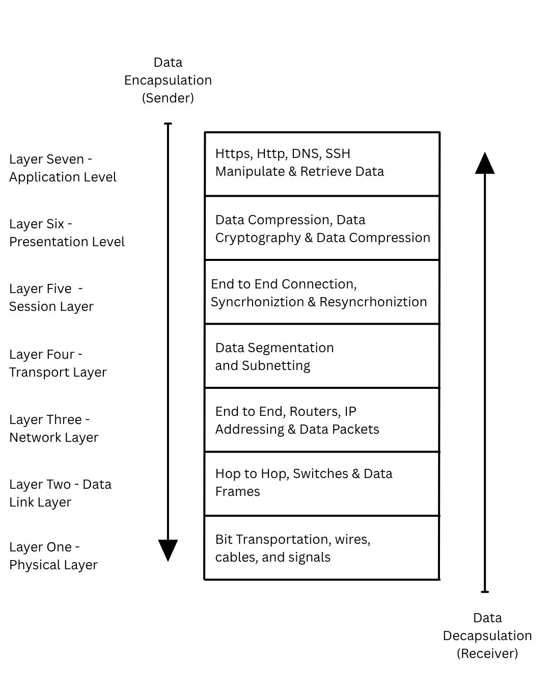

<h2> OSI Model -> Open Systems Interconnnection Model</h3>

    Still in progress*** Dovelopement note: Include MAC Adressing and network interface card (NIC) in the layer two description

    <h3>Summary:</h3>
    
This is a research / personal project on the interwokrings and fundumental processes of the Open System Interconnection Model (OSI Model). 

The Open system Interconnection Model is a seven layer conceptual model that characterizes and stadarizes the communication functions of a telecommunication or computing system across the industry.
    Consider this: A Mac system wants to communicate with a Windows system, programmed differently, this would've been imposible. However, due to the Open Systems Interconnection Model (OSI Model), the seperate systems are able to commmunicate and send data arcoss the internet.
    

        The systems are able to do so via industry Standardized Protocals, from start to finish data gets passed along a seven layered stack with each layer doing something different.
    

<h3>Vocabulary</h3>
    <ul>
        <li><b>Router</b> - A router allows for connections across the internet. It is a componenet that contains multiple ports to connect itself to devices (often times a switch in large corperations). Routers contain IP Addresses, these allow it to find destinations. Routers can communicate to one another over large distances, these networks can be in a single location to multiple locations</li>
        

        <li><b>Switches</b> - Not to be confused with a router, a switch creates a Local Area Network for Hosts. Allows for connected devices to communicate to each other. Switches are in closer proximity than a router as they are limited due to physical connectivity.</li>
        

        <li><b>Local Area Networks (LAN)</b> - A LAN Network is created by a switch, it is a netowrk that allows to locally connected devices to communicate with each other and share data.</li>
        

        <li><b>Data Segments</b> - Data segments are apart of the Transport Layer (Layer Four). They are segments of the original piece of data that were broken apart for reliable and effiecent transport. Each Segment of data contains a layer four header.</li>
        

        <li><b>Data Packets</b> - Data Packets pertain to the Network layer (Layer three). Packets include a layer three header, these headers contain an IP Address with the end hosts address.</li>
        

        <li><b>Data Frames</b> - Data Frames are encapsulated and decapsulated in the Data Link Layer (Layer two). Each from contains a Layer two header and tail, within these </li>
        

        <li><b>Bianary</b></li>
        

        <li><b>IP Addresses</b></li>
        

        <li><b>Sub-Networks and Subnetting</b></li>
        

        <li><b>Protocals</b></li>
        

        <li><b>Adjacent Layer interactions</b>
            <ul>
                

                <li>Eencapsulation</li>
                

                <li>Decapsulation</li>
            </ul>
            

        <li><b>Same-Layer Interactions</b></li>
        

        </li>

    </ul>

<h2>The Open System Interconnection Layers </h2>
<ul>
    <li><h3>Layer Seven: Applications Layer</h3>
        
This Layer is the closest to the end user, the layer we see. While Applications are not apart of the Application Layer, protocals such as HTTPS, HTTP and DNS also pertain here (EX: https://www.cisco.com). Top most layer. 

        
<b>Action:</b> Present as a communcation partener within the user inputs and the network its data travels through.

        

            <b>Goal:</b> Identifity communication partners and synchronizing communications, The application Network allows you to send, manipulate and retreve data using the network. This can be done via:
            <ul><li>Encapsulation & Decapsulation - Following the OSI Model Path (proceeding down the stack and up the stack again).
                <li>Same Layer Interation - Communiation between the application layers of the two different systems (Layer 7 to Layer 7 interactions).</li>
            </li></ul>
        

    </li>
    <li><h3>Layer Six: Presentation Layer </h3>
        
This layers resposibility is to translate the data between the application/protocal and the network formats. Aswell as the ocasional file compression to improve the speed and effiecency for in which the data is transfered. Depending on if you're encapsulating data (working from Layer 7 to Layer 1) or decapsulting data (working from layer 1 to layer 7) on the stack, you might alos be encrypting or decrypting data at this level.

    </li>
    <li><h3>Layer Five: Session</h3>
        
Just as the name implies, a session is a duration and period of time in which a two devices had a connection, from first opened to close. This level ensures that the session stays open long enough to complete the data transfer just to then close it once the process is complete to avoid wasting resources.<n> Syncrhoniztion and Resyncronization techniques. <i>Syncrhoniztion points</i> are checkpoints inserted into the data stream, incase of a session interuption, <i>Resysncronization</i> allows the session to reset to a known state. A common example of this technique can be found when downloading a file, every xx mb or gb, a checkpoint is placed, incase of a session interuption, we can always refer back to the closest checkpoint.</n>

        
<b>Action:</b> Sets Up, manages and terminates connections between the local host and the remote host.

        
<b>Goal:</b> Create & manage a connection between a local application and a remote application. Imbedded with a Syncrhoniztion and Resyncronization technique to improve data stream effiecency.

    </li>
    <li><h3>Layer Four: Transport Layer</h3>
        
This layer is responsible for network traffic betwen hosts, as mentioned in <a Href ="https://learningnetwork.cisco.com/s/article/osi-model-reference-chart"> The CISCO Learning Network</a>; it "ensures that mesages are delivered error-free, in sequence, and with no losses or duplications". Layer Four is where we see a change in developer roles, while Application Delelopers typically work from layer Seven to Five, Network Developers focus on layer four through one. In Layer four, we see the data begin to assemble itself. If large enough, for reliable and effiecient transport of data, the transport layer tends to break data in fragments or better yet "Segments". With this, a layer four header is attached onto each segment. At this stage, the data can be classified as a "Segment". 

        
<b>Goals:</b> Guarentee Data is delivered to its destination with accuracy and efficency using segments. 
    </li>
    <li><h3>Layer Three: Network Layer</h3>
        
Routers operate in this layer, routers are used to connect seperate hosts arcoss the internet (I.E Outside of a Local Area Network). This is what the Network Layer is doing, logically joining networks using IP adressing (32 Bits, represented as 4 octets, each ranging from 0 - 255). The IP Address is then stored within a Layer Three Network Header, creating a "Packet". Commonly misinterpreted with the structure of Layer two, the IP Address provides us an end to end path. Once at a router, the Layer Two frame gets decapsulated, the end to end IP Adresses within the packet is revealed. Once revealed the the destination is visable and proceeds in said direction.

        
<b>Action:</b> Route data across the internet by associting each segment (created in Layer Four: Network layer) with an IP address in the header creating a "Packet" (if you are encapsulating data) or Fragmentation and Reassembing packets (if you are decapsulating data) for end to end data transmission. 

        
<b>Goal:</b> Subnet networks to prevent IP Waste, Peformance Issues, and Mitigate Security Risks. Allowing us to save IP address storage (for future host growths with the Local Area Network), keep networks faster, and protect sensitive data.
    </li>
    <li><h3>Layer Two: Data Link</h3>
        
Similar to Layer Three (The Network Layer), layer two is responsible for network traffic between nodes (I.E. Pc to Switch, Switch to Router, or Router to Router) over the Physical Layer (Layer one). Like the Network Layer, the Data Link Layer attaches. Switches and bridges operate at this level. To ensure data transfer is error free, Layer Two attaches a layer two header aswell as a layer two tail to the existing packet (Occurs during encapsulation), creating a "frame". Once the frame is sent over the connection (Either via signals or the Internet) to the reciving node (Typcially a router), decapsulation of the Data Link Layer (Layer Two; Header and Tail) occurs, revealing the IP Address stored in the Layer Three Netowork Header. With the IP Address revealed, we know where to send the packet. Encapsulation occurs once more just before the data gets sent over to its next destination, a new Layer Two header and tail is then added onto the "Packet" creating a "Frame".

        
<b>Action:</b> Associates the data packet into frames containng a layer two head and a layer two tail (Encapsulation).

        
<b>Goal:</b> Ensure an error free transfer from node to node for data frames, letting layers above it to remain intact.

    </li>
    <li><h3>Layer One: Physical Layer</h3>
        
This layer is the physcial and electrical communication of unstructured raw data, using bits. Digital Bits are converted into electrical (wired connections) or radio waves (wireless connections). As per the name implies, this layer defines the physical characteristics used to transfer data between devices. Such as voltage levels, maximum transmission distances and physical connectors.

        
<b>Goal:</b> Contains data in the form of bits, uses physical methods to transport said data from on node to the next. Upong reciving data, the signals get converted into 1's and 0's sending it to the data link layer putting the frames back together. 

    </li>
</ul>

    

<b>Citations and Referances:</b>

<a href = "https://learningnetwork.cisco.com/s/article/osi-model-reference-chart"><i>The CISCO Learning Network "OSI Model Reference Chart" :  https://learningnetwork.cisco.com/s/article/osi-model-reference-chart</i></a>

<a href = "https://www.geeksforgeeks.org/computer-networks/open-systems-interconnection-model-osi/"><i>Geeks for Geeks "What is the OSI Model? - Layers of OSI Model" :  https://www.geeksforgeeks.org/computer-networks/open-systems-interconnection-model-osi/</i></a>

<a href = "https://www.coursera.org/articles/application-layer" ><i>Coursera "Understanding the Apllication Layer of the OSI Model" - Coursear Staff : https://www.coursera.org/articles/application-layer</i></a>
